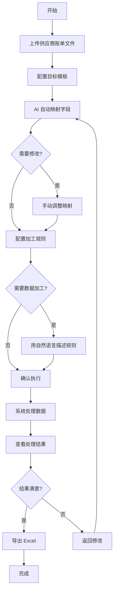

# 智运结算 AI - 产品需求文档 (PRD)

> 文档版本：1.1  
> 更新日期：2026-01-14  
> 产品负责人：待定

---

## 更新记录

| 版本 | 日期 | 更新内容 |
|------|------|----------|
| v1.3.1 | 2026-01-14 | 新增 GitHub Actions CI/CD 配置，自动构建并发布 macOS/Windows 安装包 |
| v1.3 | 2026-01-14 | 新增 Electron 桌面客户端打包支持，生成 macOS DMG 安装包 |
| v1.2.1 | 2026-01-14 | 新增部署指南文档（DEPLOYMENT.md），支持 Vercel/Docker/Electron/传统服务器四种方案 |
| v1.2 | 2026-01-14 | 新增上传模板文件功能，AI 自动解析目标字段 |
| v1.1.1 | 2026-01-14 | 修复增量映射导致字段重复显示的问题（使用 Map 去重 + useRef 追踪已处理字段） |
| v1.1 | 2026-01-14 | 新增增强版源文件预览功能（AI智能解读）；优化AI字段映射支持增量映射 |
| v1.0 | 2026-01-13 | 初始版本 |

---

## 一、产品概述

### 1.1 产品定位

**智运结算 AI** 是一款面向物流财务人员的智能对账工具，通过 AI 技术自动识别和映射多个供应商的 Excel 账单字段，将杂乱的数据格式统一转换为标准模板，大幅提升对账效率。

### 1.2 解决的核心问题

| 痛点 | 现状 | 解决方案 |
|------|------|----------|
| 格式不统一 | 每个供应商的账单格式都不同 | AI 自动识别字段，智能映射 |
| 手工对账慢 | 每月花费数天人工整理 | 批量上传，一键处理 |
| 易出错 | 复制粘贴导致数据错误 | 自动校验，异常提醒 |
| 重复劳动 | 每月重复同样的整理工作 | 保存模板，复用规则 |

### 1.3 目标用户

- **主要用户**：物流企业财务部门、结算专员
- **使用场景**：每月与 N 个物流供应商进行费用核对
- **用户特征**：熟悉 Excel 操作，但不懂编程

---

## 二、产品功能架构

```
┌─────────────────────────────────────────────────────────────┐
│                      智运结算 AI                             │
├─────────────────────────────────────────────────────────────┤
│  ┌───────────┐  ┌───────────┐  ┌───────────┐  ┌───────────┐ │
│  │  源文件   │  │  AI 字段  │  │  规则     │  │  对账     │ │
│  │  接入     │→ │  映射     │→ │  配置     │→ │  执行     │ │
│  └───────────┘  └───────────┘  └───────────┘  └───────────┘ │
│       ↓              ↓              ↓              ↓        │
│   上传Excel     自动识别字段    设置加工规则    导出结果    │
└─────────────────────────────────────────────────────────────┘
```

---

## 三、核心功能说明

### 3.1 源文件接入

**功能描述**：用户上传一个供应商的多个文件（一份账单的加工可能需要多个来源）。

**功能要点**：
- ✅ 支持拖拽或点击上传
- ✅ 支持批量上传多个文件
- ✅ 支持格式：`.xlsx`、`.xls`、`.csv`
- ✅ 单文件最大 100MB（超过时自动拆分处理）
- ✅ 自动解析文件结构，识别工作表和字段

**用户看到的**：
- 上传进度条
- 解析成功/失败状态
- 文件包含的行数
- 可点击预览文件内容（支持查看多个 Sheet 的信息）

#### 3.1.1 增强版源文件预览（v1.1 新增）

**功能描述**：点击已上传文件，弹出增强版预览弹窗，提供 AI 智能解读能力。

**UI 布局**：三栏布局设计
- **左侧边栏**：解析摘要 + Sheet 页签 + AI 提取核心字段
- **中间区域**：数据表格预览（斑马纹、固定表头）
- **右侧面板**：AI 智能解读结果

**功能要点**：
- ✅ **解析摘要**：显示总行数、有效列数
- ✅ **Sheet 页签切换**：支持多 Sheet 文件的快速切换预览
- ✅ **AI 提取核心字段**：自动识别运单号、发货时间、始发地、目的地、计费重量、总费用、收件人等核心字段并以标签形式显示
- ✅ **AI 智能解读面板**：
  - 自动识别供应商/数据来源
  - 推断账单周期
  - 识别结算币种
  - 潜在异常提示（如异常记录、拒收等）
- ✅ **确认使用按钮**：确认使用此文件进行后续处理

---

### 3.2 目标模板配置

**功能描述**：定义最终输出的标准格式，即"希望整理成什么样子"。

**功能要点**：
- ✅ 选择已有模板或新建模板
- ✅ 自定义字段名称（如：发票号码、发货日期、总费用）
- ✅ 设置字段类型（文本/日期/金额/数字）
- ✅ 可添加字段备注说明

#### 3.2.1 上传模板文件（v1.2 新增）

**功能描述**：在新建模板时，用户可以上传一个现有的模板 Excel 文件，AI 自动解析并提取目标字段。

**功能要点**：
- ✅ **一键上传**：点击「上传模板文件」按钮选择 Excel/CSV 文件
- ✅ **AI 智能解析**：自动分析表头和样本数据，推断字段属性
- ✅ **字段属性推断**：
  - 字段名称（使用中文）
  - 数据类型（String/Number/Date/Currency）
  - 字段描述
  - 合适的图标
- ✅ **模板名称推荐**：根据文件名或内容推断模板名称
- ✅ **降级处理**：AI 解析失败时，直接使用表头作为字段名

**示例**：

| 字段名称 | 类型 | 说明 |
|----------|------|------|
| 发票号码 | 文本 | 物流商发票号，唯一标识 |
| 发货日期 | 日期 | 格式 YYYY-MM-DD |
| 总费用(含税) | 金额 | 保留2位小数 |

---

### 3.3 AI 智能字段映射

**功能描述**：AI 自动将源文件的字段与目标模板字段进行匹配。

**功能要点**：
- ✅ AI 自动分析字段名称、数据样本
- ✅ 显示匹配置信度（如 98%、65%）
- ✅ 支持手动修改映射关系
- ✅ 低置信度字段高亮提醒

#### 3.3.1 增量映射（v1.1 新增）

**功能描述**：当用户在步骤1修改或新增目标字段后，返回字段映射页面时自动对新增/修改的字段进行 AI 匹配。

**功能要点**：
- ✅ **自动检测新字段**：对比 `targetFields` 和已有 `fieldMappings`，找出需要新映射的字段
- ✅ **增量 AI 调用**：仅对新增字段调用 AI 映射接口，保留已有映射不变
- ✅ **清理无效映射**：如果目标字段被删除，自动移除对应的映射记录
- ✅ **用户反馈**：映射完成后显示 Toast 提示"已为 N 个新字段完成 AI 匹配"

**用户体验**：
```
目标字段「发票号码」  ←──  源字段「发票号 (Invoice No)」  [98% 匹配]
目标字段「发货日期」  ←──  源字段「开票日期 (Date)」      [92% 匹配]
目标字段「总费用」    ←──  源字段「amount」               [65% 匹配] ⚠️ 需确认
```

---

### 3.4 规则编辑器

**功能描述**：对于需要转换或加工的字段，用自然语言描述处理逻辑，AI 自动生成代码。

**使用场景示例**：
- "把运单号和子单号用横杠连接起来"
- "日期格式从 10/15/2023 转换成 2023-10-15"
- "金额乘以 1.13 加上税"

**功能要点**：
- ✅ 用中文描述需求，无需写代码
- ✅ AI 生成处理逻辑
- ✅ 实时预览处理后的结果
- ✅ 校验结果是否符合预期

---

### 3.5 对账执行

**功能描述**：一键执行所有配置，处理全部数据并生成结果。

**功能要点**：
- ✅ 显示处理进度（百分比）
- ✅ 实时预览处理结果
- ✅ AI 质量审计报告
- ✅ 异常数据高亮显示
- ✅ 一键导出 Excel 结果

**AI 质量审计**：
- 字段填充率（是否有空值）
- 逻辑通过率（是否有格式错误）
- 自动发现异常并给出建议

---

## 四、用户操作流程



---

## 五、页面功能详细说明

### 5.1 首页 - 源文件接入

| 区域 | 功能 |
|------|------|
| 上传区 | 拖拽或点击上传 Excel 文件 |
| 文件列表 | 展示已上传文件，显示解析状态 |
| 文件预览 | 点击文件可查看数据预览和 AI 摘要 |
| 模板配置 | 定义目标输出的字段列表 |

### 5.2 字段映射页

| 区域 | 功能 |
|------|------|
| 映射卡片 | 每个目标字段一张卡片，显示映射关系 |
| 置信度标签 | 绿色=高置信度，黄色=需确认 |
| 修改按钮 | 点击可手动选择其他源字段 |
| 规则按钮 | 设置该字段的数据加工规则 |

### 5.3 规则编辑页

| 区域 | 功能 |
|------|------|
| 源数据面板 | 基于用户文本描述自动加载相应的源数据及样本值 |
| AI 输入框 | 用自然语言描述处理需求 |
| 代码预览 | 显示 AI 生成的处理代码 |
| 结果预览 | 实时显示处理后的样例结果 |

### 5.4 执行结果页

| 区域 | 功能 |
|------|------|
| 进度条 | 显示处理进度和预计剩余时间 |
| 结果表格 | 预览处理后的数据 |
| 审计面板 | AI 质量报告、异常提醒、优化建议 |
| 导出按钮 | 下载处理后的 Excel 文件 |

---

## 六、非功能需求

| 项目 | 要求 |
|------|------|
| 文件大小 | 单文件最大 100MB（超过自动拆分） |
| 处理速度 | 1万行数据 < 30秒 |
| 浏览器支持 | Chrome、Edge、Safari 最新版本 |
| 数据安全 | 文件仅存储在本地服务器，不上传云端 |

---

## 七、未来规划 (V2.0)

- [x] 模板保存与复用（v1.0 已实现）
- [ ] 多人协作编辑
- [ ] 定时任务自动处理
- [ ] 与财务系统对接
- [ ] 历史对账记录查询

---

## 附录：术语解释

| 术语 | 解释 |
|------|------|
| 源文件 | 供应商提供的原始 Excel 账单 |
| 目标模板 | 期望输出的标准格式 |
| 字段映射 | 将源文件的列与目标模板的列对应起来 |
| 置信度 | AI 对映射结果的确定程度（百分比） |
| 加工规则 | 对数据进行转换的处理逻辑 |
| 增量映射 | 仅对新增/修改的字段进行 AI 匹配，保留已有映射 |
